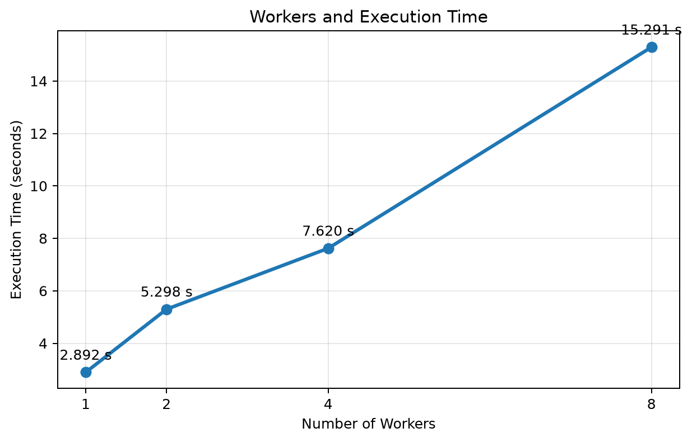

# 第12回課題：遺伝的アルゴリズムの並列化

## 1. 目的

今回の課題では、遺伝的アルゴリズムのプログラムを実行し、どの処理を並列に実行できるかを確認した。また、Worker数を1、2、4、8と変えたときに、実行時間がどのように変化するかを調べた。

プログラムでは、Rastrigin関数という、山や谷が多く存在する関数の最小値を探した。この関数は、$x=0$、$y=0$のときに最小値の0となる。

## 2. 遺伝的アルゴリズムの流れ

今回のプログラムは、主に次の流れで処理を行っている。

1. 複数の個体をランダムに作る。
2. 各個体の値を計算して評価する。
3. 評価が良い個体を親として選ぶ。
4. 親を交叉させて新しい個体を作る。
5. 一部の個体を突然変異させる。
6. 最も良い個体を残して、次の世代へ進む。

この処理を何世代も繰り返すことで、少しずつ最小値に近い個体を探している。

## 3. 並列実行できる処理

最も並列実行に向いているのは、各個体の値を計算する処理である。1つの個体を評価するときに、ほかの個体の計算結果は必要ない。そのため、個体を複数のWorkerに分けて同時に計算できる。

今回のプログラムでは、次の部分で並列計算を行っている。

```python
with multiprocessing.Pool(processes=self.num_workers) as pool:
    fitnesses = pool.map(rastrigin, population)
```

交叉や突然変異も、個体や親の組ごとに分ければ並列実行できると考えられる。ただし、親を選ぶ前にはすべての個体の評価が終わっている必要がある。また、次の世代は現在の世代の処理が終わるまで作れない。そのため、すべての処理を同時に進められるわけではない。

## 4. 実験条件

配布されたNotebookを使い、次の条件で実行した。

| 項目 | 設定 |
|---|---:|
| 個体数 | 100 |
| 世代数 | 80 |
| 突然変異率 | 0.15 |
| Worker数 | 1、2、4、8 |
| 乱数シード | 42 |

Worker数以外の条件は同じにして、処理全体にかかった時間を比べた。

## 5. 実験結果

実行結果を次の表に示す。どのWorker数でも、最終的には最小値に近い0を見つけることができた。

| Worker数 | 実行時間 | 最良値 |
|---:|---:|---:|
| 1 | 2.892秒 | 0.000000 |
| 2 | 5.298秒 | 0.000000 |
| 4 | 7.620秒 | 0.000000 |
| 8 | 15.291秒 | 0.000000 |



今回の結果では、Worker数を増やすほど実行時間が長くなった。1 Workerでは2.892秒だったが、8 Workerでは15.291秒かかった。そのため、今回のプログラムでは並列化による高速化は確認できなかった。

## 6. 考察

Worker数を増やしたのに遅くなった理由は、1つの個体を評価する計算が非常に軽いためだと考えた。Rastrigin関数の計算は短時間で終わるが、並列実行では、Workerを準備したり、計算するデータを渡したり、結果が返ってくるのを待ったりする時間が必要になる。

また、今回のプログラムは、個体を評価するたびに`Pool`を作り直している。80世代の中で何度もWorkerの作成と終了を繰り返すため、この準備時間の影響が大きくなったと考えられる。Worker数が多いほど準備する処理も増えるため、今回の結果ではさらに時間がかかった。

一方で、画像処理やシミュレーションなど、1つの個体を評価するために長い時間が必要な問題では、複数のWorkerで同時に計算する効果が大きくなると考えられる。

今回のプログラムを改善する場合は、`Pool`を毎回作り直さず、最初に作ったWorkerを何度も使う方法が考えられる。また、計算が軽い場合は、無理にWorkerを増やさず、通常の処理やNumPyを使った計算の方が速い場合もある。

## 7. まとめ

遺伝的アルゴリズムでは、各個体の評価を並列実行できる。交叉や突然変異も、処理を分ければ並列化できると考えられる。ただし、親の選択や次の世代への更新では、前の処理が終わるのを待つ必要がある。

今回の実験では、Worker数を増やすほど実行時間が長くなった。これは、目的関数の計算が軽く、Workerを準備したりデータを受け渡したりする時間の方が大きくなったためだと考えた。並列処理は、どのような場合でも速くなるわけではなく、1回の計算に時間がかかる処理で使うことが重要だと分かった。
